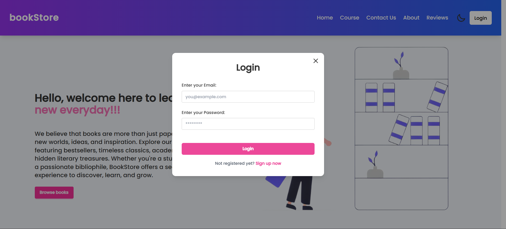
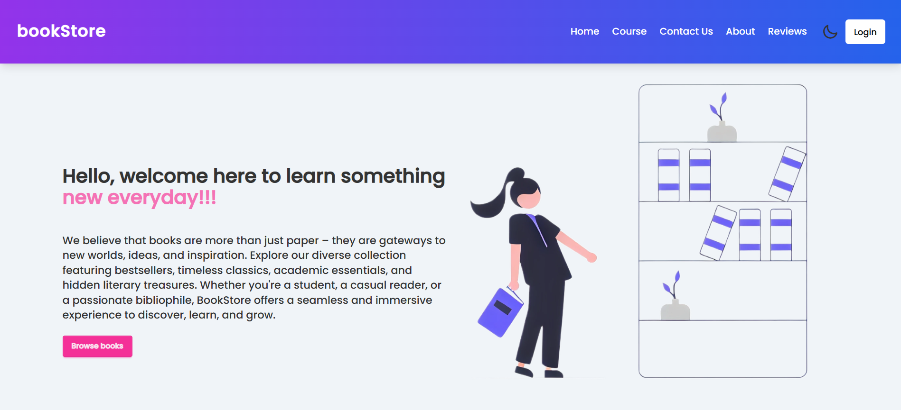
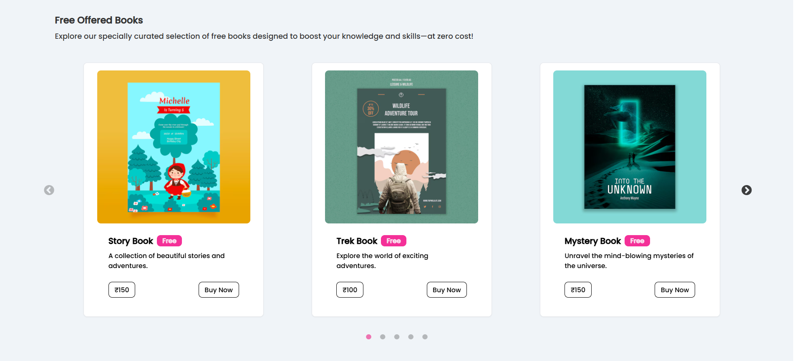
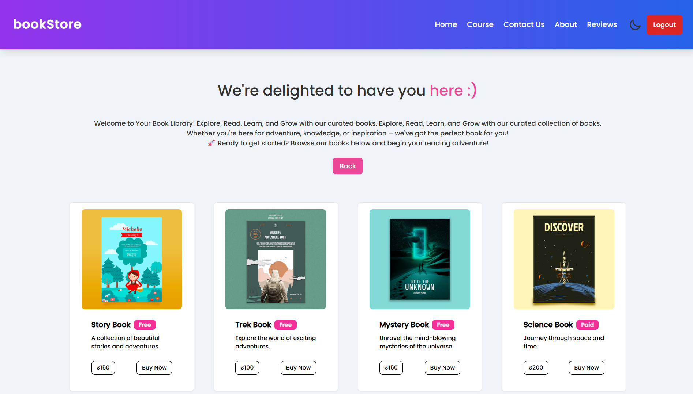
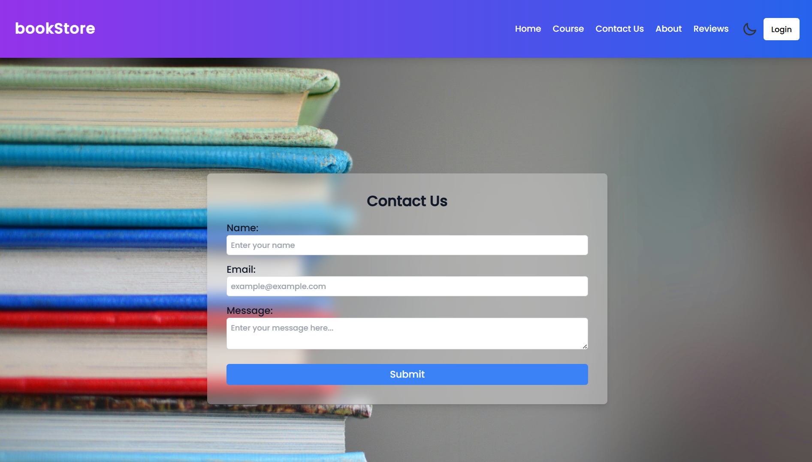
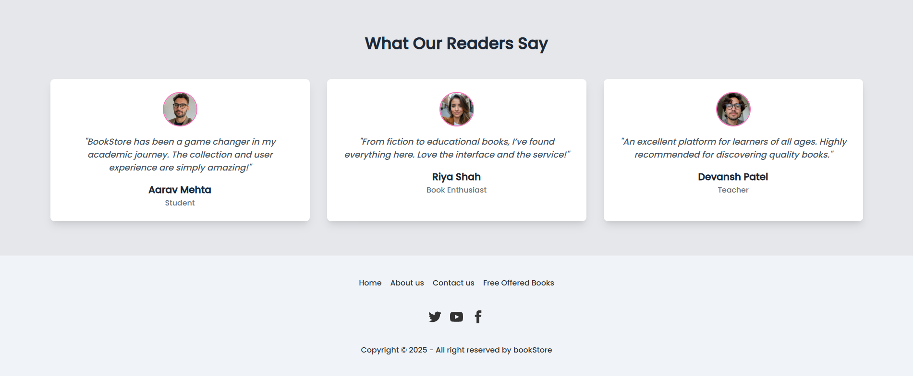

# 📚 BookStore

BookStore is a modern, responsive web application for exploring, searching, and discovering a variety of books. Users can browse courses, contact the team, and enjoy a user-friendly experience with authentication support and a light/dark theme toggle. 
Built with the MERN stack, it offers both aesthetic appeal and performance.

---

## 🌐 Live Demo

🚀 [Launching Soon]()

---

## ⚙️ Tech Stack (MERN Stack)

### Frontend:
- ⚛️ React.js (with Vite)
- 💅 Tailwind CSS & DaisyUI
- 🔄 React Router DOM
- 🌗 Theme Toggle (Light/Dark Mode)
- 🔥 React Hot Toast for Notifications
- 🎯 React Hook Form for Form Handling

### Backend:
- 🛠️ Node.js & Express.js
- 🛡️ JWT Authentication
- 🧠 MongoDB (via Mongoose)
- 📦 Axios for API calls

---

## ✨ Features

- 🔐 User Signup & Login (Modal-based)
- 🎨 Light / Dark Mode Toggle
- 📬 Contact Form with Validation
- 🔍 Search Functionality in Navbar
- 📖 Courses (Protected Route)
- 🧾 Testimonials & About Sections
- 🌍 Fully Responsive Design

---

## 📸 Screenshots

### 🔐 Login Modal


### 🏠 Home Page


### 📖 Free Books Section


### 📚 Courses Page


### 📚 Contact Us Form


### 📖 Testimonials Section


---

## 🎬 Watch Demo


---

## 🚀 Installation

### Clone the repository  
```bash
git clone https://github.com/your-username/bookStoreNew.git
cd bookStoreNew
````

### Install frontend dependencies

```bash
cd Frontend
npm install
npm run dev
```

### Install backend dependencies

```bash
cd ../Backend
npm install
npm run dev
```

---

## 📂 Folder Structure

```
BookStore/
├── Frontend/
│   ├── src/
│   └── public/
├── Backend/
│   ├── routes/
│   ├── models/
│   └── controllers/
└── README.md
```

---

## 🙋🏻‍♀️ Author

**👩🏻‍💻 Heta Shah**
📎 [Portfolio](https://hetashah30.github.io/MyPortfolio)
🔗 [LinkedIn](https://www.linkedin.com/in/heta-shah30/)

---
